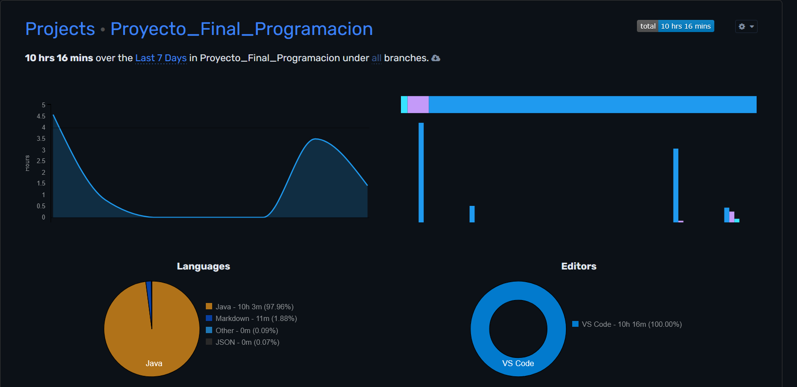
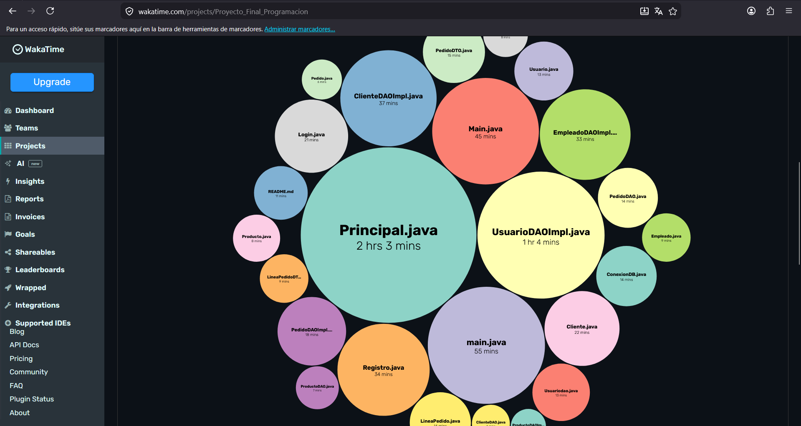

# 🍕 Pizzería Jero Pepperoni — Sistema de Gestión

**Módulo:** Programación · 2º DAW · Curso 2025-26  
**Centro:** IES Francisco Ayala — Granada  
**Tecnologías:** Java 17 · MySQL · JDBC · Swing · Patrón DAO · Arquitectura MVC

---

## 1. Descripción General del Proyecto

**Pizzería Jero Pepperoni** es una aplicación de escritorio desarrollada en Java que permite gestionar de forma integral todos los aspectos de una pizzería: clientes, empleados, carta de productos y pedidos.

### Funcionalidades principales

- **Autenticación:** Login seguro con validación de credenciales contra base de datos.
- **Registro dinámico:** Formulario que adapta los campos según el rol seleccionado (cliente o empleado).
- **Gestión de clientes:** Alta, consulta, modificación y baja de clientes.
- **Gestión de empleados:** CRUD completo de empleados con cargo y salario.
- **Gestión de productos:** Administración de la carta (pizzas, pastas, entrantes, postres, bebidas).
- **Gestión de pedidos:** Control de pedidos con actualización de estado en tiempo real.
- **Gestión de usuarios:** Panel de administración de todos los usuarios del sistema.
- **Tema dinámico:** Cambio de apariencia desde el menú en tiempo de ejecución.
- **Cambio de contraseña:** Opción disponible desde el menú de sesión.

---

## 2. Arquitectura y Estructura del Proyecto

El proyecto sigue una arquitectura **MVC (Modelo-Vista-Controlador)** con el patrón **DAO (Data Access Object)** para la capa de persistencia.

```
Proyecto_Final_Programacion/
├── src/
│   ├── db/
│   │   └── ConexionDB.java          ← Gestión de Connection y transacciones
│   ├── model/
│   │   ├── Usuario.java             ← POJO base (Joined Table Inheritance root)
│   │   ├── Cliente.java             ← Extiende Usuario
│   │   ├── Empleado.java            ← Extiende Usuario
│   │   ├── Producto.java            ← Entidad principal del dominio
│   │   ├── Pedido.java              ← Cabecera de la relación N:M
│   │   └── LineaPedido.java         ← Detalle del pedido
│   ├── dao/
│   │   ├── UsuarioDAO.java          ← Interfaz CRUD usuario
│   │   ├── UsuarioDAOImpl.java      ← Implementación con JDBC
│   │   ├── ClienteDAO.java
│   │   ├── ClienteDAOImpl.java
│   │   ├── EmpleadoDAO.java
│   │   ├── EmpleadoDAOImpl.java
│   │   ├── ProductoDAO.java
│   │   ├── ProductoDAOImpl.java
│   │   ├── PedidoDAO.java
│   │   └── PedidoDAOImpl.java
│   ├── dto/
│   │   ├── PedidoDTO.java           ← JOIN pedidos + cliente + empleado
│   │   └── LineaPedidoDTO.java      ← JOIN líneas + nombre producto
│   ├── view/
│   │   ├── Login.java               ← Ventana de inicio de sesión
│   │   ├── Registro.java            ← Ventana de registro con campos dinámicos
│   │   └── Principal.java           ← Dashboard principal con JMenuBar + JTable
│   └── Main.java                    ← Punto de entrada de la aplicación
├── lib/
│   └── mysql-connector-j-9.7.0.jar ← Driver JDBC
├── sql/
│   └── restaurante_db.sql           ← Script SQL completo con datos de prueba
└── documentacion/
    ├── README.md
    ├── documentacion.pdf
    └── documentacion.docx
```

### Arquitectura MVC

| Capa | Paquete | Responsabilidad |
|------|---------|-----------------|
| **Modelo** | `model/` | POJOs con los datos del dominio. Sin lógica SQL. |
| **Vista** | `view/` | Interfaz gráfica Swing. Sin acceso directo a BD. |
| **Controlador/DAO** | `dao/` | Toda la lógica SQL. Comunicación con la BD. |

### Patrón DAO

Cada entidad tiene una **interfaz** que define el contrato y una **implementación** que contiene el SQL real:

- Las vistas nunca contienen SQL
- Toda comunicación se realiza a través de objetos de dominio
- `try-with-resources` en todos los métodos con Connection, PreparedStatement y ResultSet
- `PreparedStatement` exclusivamente — prohibido concatenar SQL
- Transacciones manuales con `setAutoCommit / commit / rollback`

---

## 3. Modelo de Base de Datos

### Diagrama de tablas

```
usuarios (tabla raíz)
    ├── clientes (tabla hija — Joined Table Inheritance)
    └── empleados (tabla hija — Joined Table Inheritance)

productos (entidad principal del dominio)

pedidos (relación N:M entre clientes y productos)
    └── lineas_pedido (detalle del pedido)
```

### Descripción de tablas

| Tabla | Descripción |
|-------|-------------|
| `usuarios` | Tabla raíz con username, password, email, nombre, apellidos, DNI y rol |
| `clientes` | Tabla hija con FK primaria a usuarios. Añade teléfono y dirección |
| `empleados` | Tabla hija con FK primaria a usuarios. Añade cargo y salario |
| `productos` | Carta de la pizzería: pizzas, pastas, entrantes, postres y bebidas |
| `pedidos` | Cabecera del pedido con cliente, empleado, fecha, estado y total |
| `lineas_pedido` | Detalle: producto, cantidad y precio unitario de cada línea |

### Joined Table Inheritance

Las tablas `clientes` y `empleados` implementan el patrón **Joined Table Inheritance**:
- Su clave primaria (`usuario_id`) es a la vez **clave foránea** de `usuarios.id`
- Al eliminar un usuario, el **CASCADE** elimina automáticamente su fila hija
- En Java, `Cliente` y `Empleado` extienden la clase `Usuario`

### Claves foráneas con CASCADE

```sql
-- clientes → usuarios
CONSTRAINT fk_cliente_usuario FOREIGN KEY (usuario_id) REFERENCES usuarios(id) ON DELETE CASCADE

-- empleados → usuarios  
CONSTRAINT fk_empleado_usuario FOREIGN KEY (usuario_id) REFERENCES usuarios(id) ON DELETE CASCADE

-- pedidos → clientes
CONSTRAINT fk_pedido_cliente FOREIGN KEY (cliente_id) REFERENCES clientes(usuario_id) ON DELETE CASCADE

-- lineas_pedido → pedidos
CONSTRAINT fk_linea_pedido FOREIGN KEY (pedido_id) REFERENCES pedidos(id) ON DELETE CASCADE
```

---

## 4. Instrucciones de Instalación y Ejecución

### Requisitos previos

- Java JDK 17 o superior
- XAMPP con MySQL activo (puerto 3306)
- Visual Studio Code con Extension Pack for Java

### Paso 1 — Importar la base de datos

1. Abre **phpMyAdmin** en `http://localhost/phpmyadmin`
2. Ve a la pestaña **SQL**
3. Pega el contenido del archivo `sql/restaurante_db.sql`
4. Haz clic en **Continuar**

O desde la terminal:
```bash
mysql -u root < sql/restaurante_db.sql
```

### Paso 2 — Abrir el proyecto en VS Code

1. Abre VS Code
2. `Archivo → Abrir carpeta` → selecciona `Proyecto_Final_Programacion/`
3. Asegúrate de que el archivo `.vscode/settings.json` contiene:

```json
{
    "java.project.sourcePaths": ["src"],
    "java.project.referencedLibraries": ["lib/**/*.jar"]
}
```

### Paso 3 — Ejecutar la aplicación

1. Asegúrate de que **XAMPP tiene MySQL en verde**
2. Abre `src/Main.java`
3. Pulsa el botón **▶ Run** o `Ctrl+F5`

### Credenciales de prueba

| Usuario | Contraseña | Rol |
|---------|------------|-----|
| `admin` | `admin123` | admin |
| `pepe_cam` | `empleado123` | empleado |
| `ana_cliente` | `cliente123` | cliente |

---

## 5. Enlace al Repositorio de GitHub

🔗 **[https://github.com/JeronimoOsorio/Proyecto_Final_Programacion](https://github.com/JeronimoOsorio/Proyecto_Final_Programacion)**

El repositorio contiene commits regulares y descriptivos a lo largo de todo el desarrollo del proyecto.

---

## 6. Extensiones Implementadas

### Tema dinámico (Modo oscuro)

La aplicación incluye un sistema de cambio de tema desde el menú **🎨 Tema** en la barra de navegación principal.

- **Implementación:** Variable estática `temaOscuro` que persiste entre ventanas
- **Integración:** El constructor de `Principal` aplica el LookAndFeel antes de construir la UI
- **Acceso:** `Menú → Tema → Modo oscuro`

---
## 7. Capturas de WakaTime





---

## 8. Autor

**Nombre:** *Jerónimo Osorio Gómez*  
**Curso:** 2º DAW — IES Francisco Ayala — Granada  
**Año:** 2025-26
